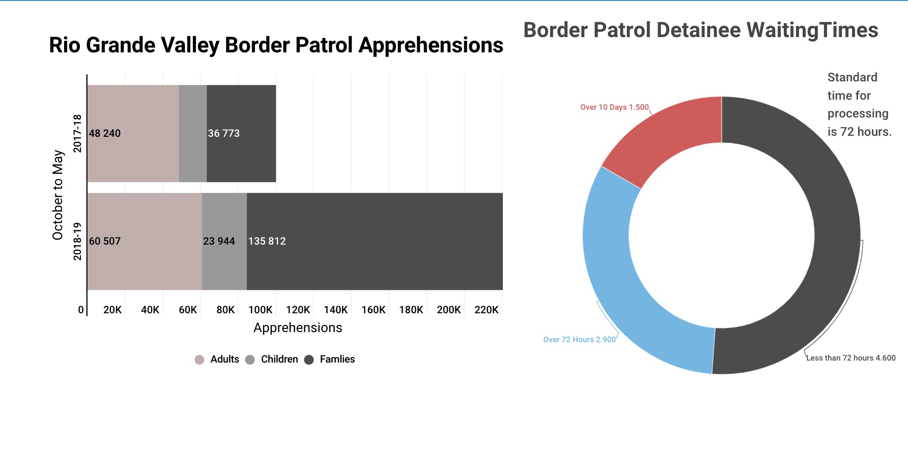
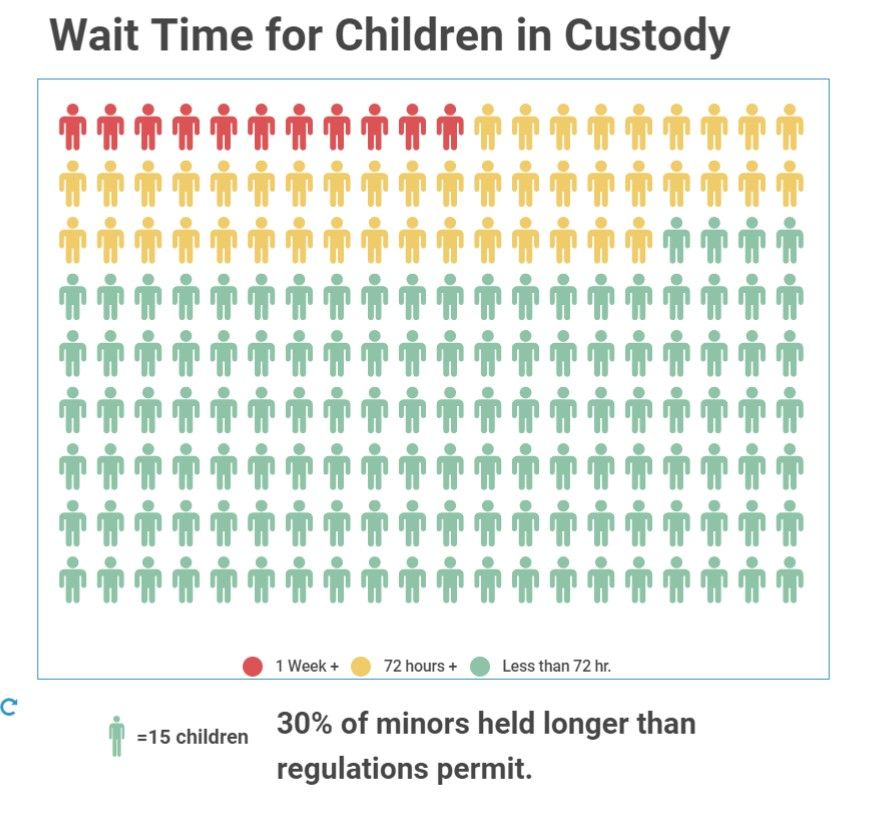

# DHSOIG

https://elliottwalters.github.io/DHSOIG/

I did two in infogram real quick to get an idea on how things might end up looking. Really basic chart but it highlights the biggest issue. The bars are way to fat though. It looked better on the site before I published it here.

<iframe title="Border Crossings Jump" aria-label="Column Chart" src="//datawrapper.dwcdn.net/pA6Fa/1/" scrolling="no" frameborder="0" style="border: none;" width="320" height="400"></iframe>

I decided to try stacked bars and I am happier with the results. The jump is very clear. Red for emphasis on the big jump. Not sure if I like the bold color or not.

<iframe title="Change in Border Crossing&amp;nbsp; Apprehensions" aria-label="Stacked Bars" src="//datawrapper.dwcdn.net/mvLIq/1/" scrolling="no" frameborder="0" style="border: none;" width="600" height="176"></iframe>

This is where it ended up after going over it again. This is for the DHS side of the assignment and is an obvious quick call for more funding and fast.

This is more from a journalist perspective. To try and make it less abstract I used people for the waffle pieces and tried to go with a green yellow red set to match with street light feeling people are comfortable with.

Costello, J. (July 02, 2019) DHS Needs to Address Dangerous Overcrowding.Washing D.C. Department of Homeland Security
